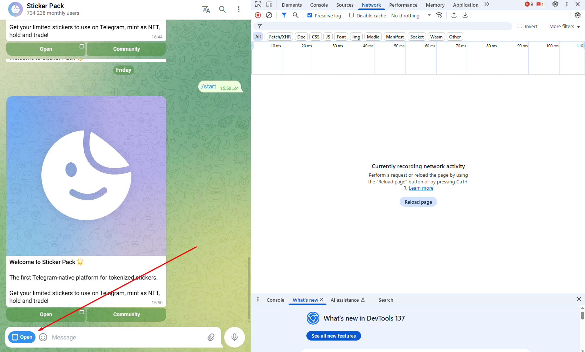
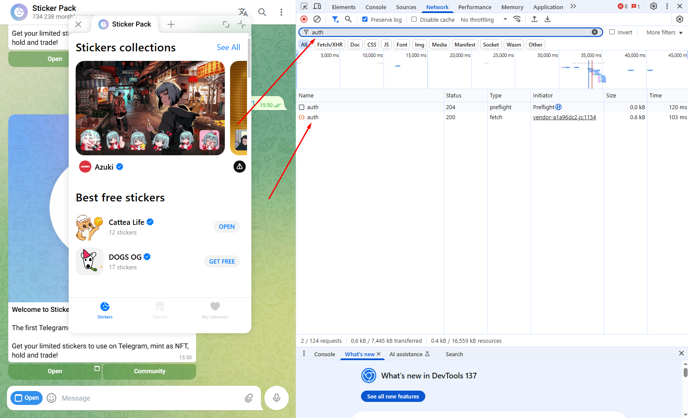
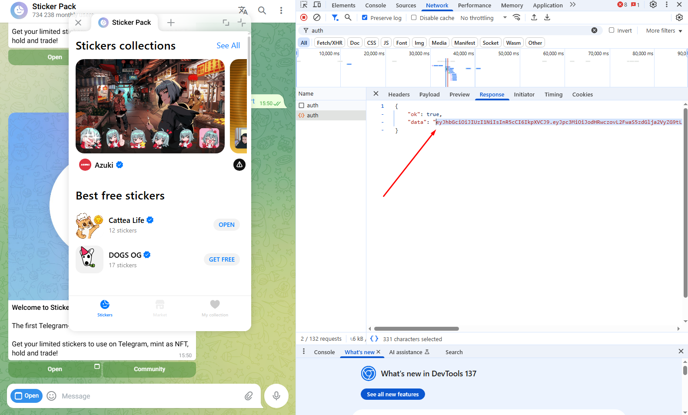

# Sticker Hunter Bot

Бот для автоматической покупки стикеров на [stickerdom.store](https://stickerdom.store). Мониторит новую коллекцию и покупает, когда она станет доступной.

## Установка

```bash
pip install -r requirements.txt
```

## Настройка

Отредактируйте `config.py`:

```python
# Твой JWT токен (см. раздел ниже)
jwt_token = "eyJ..."

# Seed фраза от TON кошелька (24 слова)
ton_seed_phrase = "word1 word2 ... word24"

# Сколько стикеров покупать за раз (макс 5)
stickers_per_purchase = 5

и остальные..
```

## Запуск

Формат: `character_id/collection_id`

```bash
python main.py 2/19
```

## Как работает

1. Бот проверяет коллекцию каждую секунду  
2. Если коллекции ещё нет — ждёт, пока появится  
3. Когда появляется нужный стикер — покупает максимум возможного за текущий баланс  

## Получение JWT токена (важно, получать его пока БОТ НЕ ЛЕЖИТ, но токен действует только 60 минут, поэтому нужно получить его заранее до начала сейла, но не раньше чем за 60 минут до сейла, учитывайте переносы)

### Пошаговая инструкция:

1. **Залогиньтесь в Телеграм в браузере** (на который будут покупаться стикеры), откройте DevTools (F12), перейдите в личку с Sticker Pack (https://web.telegram.org/a/#7686366470) и нажмите Open.



2. **В поиске в DevTools** напишите `auth` и выберите запрос как на скрине.



3. **Перейдите во вкладку Response** и скопируйте JWT токен, его и вставляете в конфиг.




## Как получить цифры для запуска софта?

Откройте любой стикерпак через браузер (будет кнопка открыть в Web). В ссылке будут цифры, например 2/19 (https://stickerdom.store/bundle/2/19). Вам нужно изучить паттерн, исходя уже существующих стикерпаков и понять, какие цифры после bundle будут идти у новой коллекции, и при запуске писать именно их, например python main.py 3/20


## Важно перед запуском

> **Не забудьте пополнить нужную сумму TON на кошелек перед началом сейла**

---

## Контакты

**Телеграм канал:** [@enbanends_home](https://t.me/enbanends_home)

---


